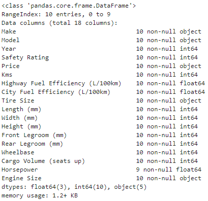
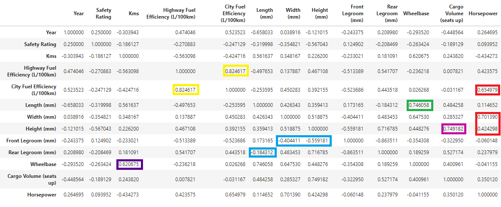
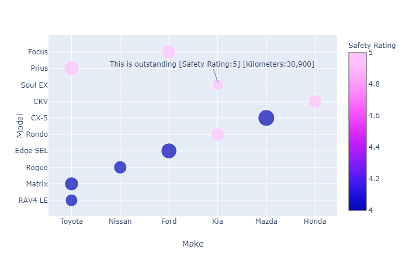
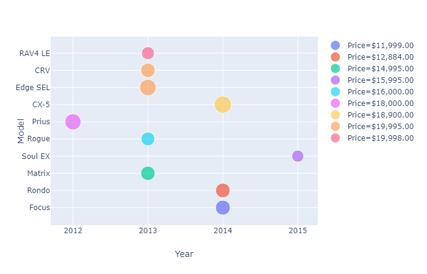
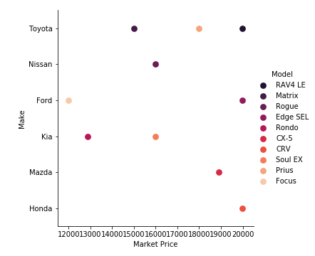
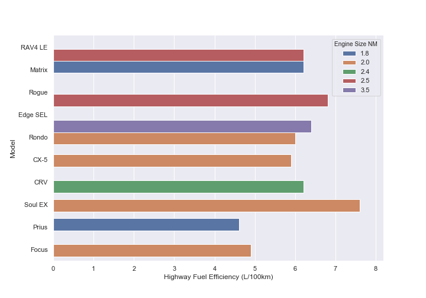
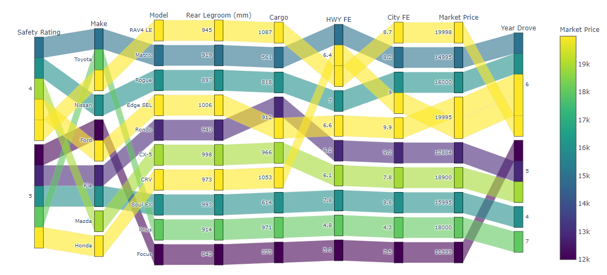
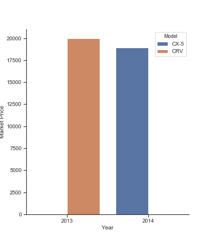

## Sue plans to purchase a vehicle, what would be our suggestion for her to make a smart decision before making any choice.  

**Constraints**

1.`Three family members and a dog`<br>
2.`Vehicle's odometer reads <= 250,000 km`<br>
3.`Fuel efficiency`<br>
4.`Storage Space`<br>
5.`Safety rating`<br>
6.`Cargo Volume` <br>
7.`Total cost of owning and servicing`

**Content**

Make - brand of the vehicle<br>
Model - the name of a car product <br>
Year - the year of sales <br>
Safety rating - how well a vehicle preserves its occupants from an accident <br>
Price - the market worth of the car <br>
Kms - kilometers it's driven <br>
Highway Fuel Efficiency (L/100km) - highway fuel consumption in liters per 100km <br>
City Fuel Efficiency (L/100km) - city fuel consumption in liters per 100km <br>
Tire Size - tire diameter of the car <br>
Length (mm)- length of the car in millimeters <br>
Width (mm)- width of the car in millimeters <br>
Height (mm) - the height of the car in millimeters <br>
Front Legroom (mm) - front legroom for driver and next to the driver's passenger seat <br>
Rear Legroom (mm) - rear legroom for passengers <br>
Wheelbase - the distance between the centers of the front and rear wheels <br>
Cargo Volume (seats up) - storage space in the <br>
Horsepower - the power of the engine <br>
Engine Size - Engine size of the vehicle for instance; 2.5L,1.8L, etc


```python
import pandas as pd
import numpy as np
import seaborn as sns
import plotly_express as px
import plotly.graph_objs as go
import matplotlib.pyplot as plt
from datetime import datetime
%matplotlib inline
```
```python
car_data = pd.read_csv('test_data.csv')
car_data.head()
```


```python
car_data.info()
```


_We have ten rows for each every column except <span style="color:red"> Horsepower </span>._

```python
car_data.corr()
```



<br>

#### Correlation matrix

##### I have observed and marked a few cardinalities in colors to determine whereby I am going to represent these data in later sections.

* From our problem parameters, it exhibits Sue has three family members and a dog and this will be the family's prime mode of transport, which implies we need more space in the Front, Rear Legroom and Cargo Space should be little bigger than the most average car.

* It's quite clear from our dataset's correlation <span style="color:#3192F4"> **Length:-0.184312, Width:-0.404411, Height:-0.55918** </span> is the key factors to define more Legroom in the Front and Rear. Height and width has a relation with Rear Lagroom size (0.483453, 0.716785).
* On the other hand, <span style="color:#D00362"> **Cargo Volume (seats up): 0.749182** </span> has a relation with `Length` of the car.
* Highway Fuel Efficiency (L/100km) and city Fuel Efficiency (L/100km)  <span style="color:#FCF812"> **Fuel Efficiency: 0.824617** </span> is correlated.

* Wheelbase is mostly dependent on Length and sequentialy, for Width and Height i.e., <span style="color:green"> **Wheelbase length relation: 0.740658** </span>. However, more the wheelbase the kilometer's units also gets effected. <span style="color:#5A0FA0"> **Kms: 0.620675** </span>

* Lastly, Horsepower depands on the car width, it's logical that engine needs more power to drive a bigger body/structure of a car
<span style="color:#D82D0F"> **Horsepower: 0.701390** </span>.


```python
car_data.replace('', np.nan, inplace=True)
car_data.head(10)
```


_Looks like for <span style="color: red">Ford Edge SEL</span> the Horsepower is not mentioned._

### Safety Rating:

Based on Sue's consideration she prioritizes the vehicle which has more safety feature. This is her **utmost priority**.

On the Sue list I have visualized ten available cars based on their `Safety Rating`. From the below diagram its shows she had selected two cars from Toyota: `Matrix` , `RAV4 LE` , Nissan: `Rogue`, Ford: `Edge SEL` and Mazda: `CX-5` all have safety rating `4`.

Nevertheless Toyota: `Prius`, Ford: `Focus`, Kia: `Ronda` and `Soul EX`, and finally, Honda: `CRV` got safety rating `5`. I am preferring those car having safety rating 5 first.

_Soul EX by Kia interesting in this case and drove least in our listed car._
* Next I am going to compare the price of each car.

```python
fig = px.scatter(car_data,x="Make",y="Model",color="Safety Rating", size="Kms")

fig.update(layout=dict(legend=dict(orientation='h', y =1.1, x=0.5), annotations=[go.layout.Annotation(text="This is outstanding [Safety Rating:5] [Kilometers:30,900]", x=3,y=7.2)]))
```


<br>

### Market Price:

It is noteworthy to comprehend that out of ten cars **five** of them were purchased in 2013. We have one car purchased in 2015 Soul EX price `15,995.00` and safety rating 5, and ones purchased in 2012 Prius also has safety rating 5. However, the least price we have here is `11,999.00` purchased in 2014, Focus from Ford safety rating 5 but drove a mass numbers of roadway 47,197 KM. Here, we have two other cars Rondo and CX-5 also purchased in 2014. The cheapest car we have from Kia has a high-grade safety rating.

<br>

```python
px.scatter(car_data,x="Year",y="Model",color="Price", size="Kms")
```



<br>

_Why don't we look closer in the car manufacturer, model and their price from the scatter plot following._

Our take out from this section,
1. The car hits Safety rating 5 and has the least price.
2. Kilometers also our main constraints for the next sections to find the best-matched car for Sue. Notably, I have chosen Rondo, CRV, Soul EX, Focus, Prius and RAV4 LE- (even though it has safety rating 4 but noticeably drove for less KM i.e., 35944).


<br>

```python
car_data['Market Price'] = car_data['Price'].str.replace('$','')
car_data['Market Price'] = car_data['Market Price'].str.replace(',','')
car_data['Market Price'] = pd.to_numeric(car_data['Market Price'])

sns.catplot('Market Price','Make',hue='Model',data=car_data,kind="point",palette='rocket')
plt.savefig('make.png')
```



### Rear Legroom:

* Following Sue has a family member of three and has a Dog she requires more Rear Legroom. In my data correlation pattern, we observed how wheelbase depends on the car's length, does it has a correlation with rear legroom for a vehicle. No! preferably we should connect with height and cargo space. Well, it appears to be just Edge SEL has a relation with wheelbase and rear legroom.

```python
sns.set(style="ticks")

fig, ax = plt.subplots(figsize=(10, 6))
car = sns.barplot(x="Rear Legroom (mm)",y="Wheelbase",hue= "Model",ax=ax, data = car_data)

def change_width(ax, new_value) :
    for patch in ax.patches :
        current_width = patch.get_width()
        diff = current_width - new_value

        patch.set_width(new_value)

        patch.set_x(patch.get_x() + diff * .5)

change_width(ax, .45)
car.legend(loc='right', bbox_to_anchor=(1.20, .76), ncol=1)
plt.savefig('rear.png')
plt.show()
```


_From the catplot below we may come to a resolution._

* Comparatively, we have noticed in the correlation table Height does involve to determine the rear legroom size. RAV4 LE, Edge SEL, CRV, CX-5 which has maximum Rear Legroom in millimeters.
* Since cargo volume is also an essential issue for Sue let's dig deeper into this, catplot below manifest how cargo volume is a dependent of car's Height and Rear Legroom. So we have cargo space 966 for CX-5 with best rear legroom and height but safety rating 4, `971 for Prius but we are not biased as it has less legroom is an unusual design!` , the largest CRV:1053 with safety rating 5 and RAV4 LE:1087 but safety rating 4. Honda CRV goes to the next part of my analysis as a champ.

### Hang on I haven't done yet there is a lot to see!

<br>

```python
sns.set(style="ticks")
sns.catplot(x="Rear Legroom (mm)", y="Height (mm)",data=car_data, hue="Cargo Volume (seats up)",col="Model", s=17,
            col_wrap=3,height=3,aspect=1.24,palette='Set1')
plt.savefig('col_model.png')
plt.show()
```


### Fuel Efficiency:

_**Let's see how certain vehicles perform in the road (Highway and city fuel efficiency).**_

* From our chosen list Soul Ex and Edge SEL looks to like a least fuel-efficient car in both Highway and City drive. In terms of best fuel efficiency, Prius could be the number one choice. The car `Focus` could also be an intelligent choice it has less fuel consumption in `city:7.5` and `highway:5.1` and smallest market price amongst all with best SF 5.

* `CRV- HWY:6.4 City:9.0` and `RAV4 LE- HWY:6.4 City:8.7` is almost close enough considering the fuel efficiency. But RAV4 LE has an SF 4 whereas, CRV is SF 5.

* `CX-5 seems more fuel efficient then CRV and RAV4 LE`

_Note: HWY= Highway and SF= Safety Rating_

```python
sns.set(style="darkgrid")
fig, ax = plt.subplots(figsize=(9, 8))
sns.despine(fig, left=True, bottom=True)
filled_markers = ('o', '8', 's', 'p', '^', 'h', 'H', 'D', 'd', 'P')

car_sf_km = sns.scatterplot(x="Highway Fuel Efficiency (L/100km)", y="City Fuel Efficiency (L/100km)",hue="Model",
                          style="Model", markers=filled_markers, s=100, data=car_data, ax=ax)
car_sf_km.legend(loc='right', bbox_to_anchor=(1.25, 0.8), ncol=1)
plt.savefig('fuel_effi.png')
plt.show()
```


* It's important to know, the car will be Sue family's primary mode of transportation. So she may go to family trip often, so we may consider the vehicle's Highway fuel efficiency and Engine size.
* I have visualized this significant data into a Bar plot to see it's performance in the highway and how it's related to the engine size.
* **So far we have two cars in our list for Sue. I am going to measure the values for other cars as well.**

1. Cx-5 is a 2.0L engine and it's HWY fuel efficiency just 6.1 L/100km
2. CRV 2.4L engine HWY fuel efficiency 6.4 L/100km, while RAV4 LE also has same fuel efficiency but engine size 2.5L.
3. Prius 1.8L engine immeasurable fuel efficient car in the highway but still not suitable for Sue's family members since it has less rear legroom and not enough cargo space.

```python
car_data['Engine Size NM'] = car_data['Engine Size'].str.replace('L','')
car_data['Engine Size NM'] = pd.to_numeric(car_data['Engine Size NM'])

fig, ax = plt.subplots(figsize=(10, 7))
sns.despine(fig, left=False, bottom=False)
car_engsize = sns.barplot(x="Highway Fuel Efficiency (L/100km)",y="Model",hue= "Engine Size NM",ax=ax, data = car_data)
def change_height(ax, new_value) :
    for patch in ax.patches :
        current_height = patch.get_height()
        diff = current_height - new_value
        patch.set_height(new_value)
        patch.set_x(patch.get_x() + diff * .5)
change_height(ax, .55)
plt.savefig('engine_size.png')
plt.show()
```



##### I will make a new field to see how many years it has been moved from today's date considering the car bought.

```python
end = datetime.now()
car_data['Year Drove'] = ((end.year)-car_data['Year'])
car_data.head()
```


* #####  'Drove/Annual' field has created to confirm the calculated values in kilometers i.e., how many Km the car had been driven periodically.

```python
car_data['Drove/Annual'] = car_data['Kms']/car_data['Year Drove']
car_data['Drove/Annual'] = car_data['Drove/Annual'].round(2)
```

### Annually driven:

* In our following visualization we have four several cars based on their tire diameter and annually driven. There are four cars possessing (P225/65R17) Passengers 17' wheel and RAV4 LE in average driven least for 6 years, on the other hand, `CRV` (225/65R17) drove in average little more then RAVE LE but still.
* Edge SEL is notable in terms of wheel size 18', I am counting better wheel size as it means better handling but unquestionably, EDGE SEL won't be suggested as it drove roughly 10,000 km yearly which is much higher in km then CRV and RAV4 LE.
* Last but not the least, CX-5 drove for 5 years and having 17' wheel but annually driven most nearly 13000 km.

```python
car_data['Tire diameter'] = car_data["Tire Size"].str[-2:]
sns.set(style="ticks")
sns.catplot(x="Drove/Annual", y="Model",  
            col="Tire diameter", hue="Year Drove", data=car_data, s=15,
            col_wrap=2,height=4
            ,aspect=1.24)  
plt.savefig('year_drove.png')
```


### Horsepower:

* Meanwhile, Edge SEL seems not having a Horsepower value, I have figured this value is critical in terms of performance, it also associated to the vehicle's width. For precise judgment, a vehicle bigger requires more horsepower.
* Accordingly, CRV is the best in this case almost 190 horsepower with engine size 2.4L.

```python
sns.set(style="ticks")
sns.catplot(x="Width (mm)", y="Horsepower",
            hue="Engine Size NM", col="Model",
            data=car_data, s=17,
            col_wrap=3,height=3,aspect=1.40)  
plt.savefig('horse.png')
```


```python
car_data['HWY FE'] = car_data['Highway Fuel Efficiency (L/100km)']
car_data['City FE'] = car_data['City Fuel Efficiency (L/100km)']
car_data['Cargo'] = car_data['Cargo Volume (seats up)']

car_cus = car_data[[ 'Safety Rating', 'Make', 'Model', 'Rear Legroom (mm)', 'Cargo', 'HWY FE', 'City FE', 'Market Price', 'Year Drove']]

px.parallel_categories(car_cus, color="Market Price", color_continuous_scale=px.colors.sequential.Viridis)
```



### Ultimate Recommendation:

##### I recall after interpreting Safety Rating, Make, Model, Rear Legroom (mm), Cargo, HWY FE, City FE, Market Price, Year Drove these constraints we all can acknowledge that CRV is the ultimate champions in the race. We can also admit CX-5 manufactured in the 2014 year if it meets all safety requirements that Sue's demand.

```python
car_2data = (car_data.loc[car_data['Model'].isin(['CRV','CX-5'])])
```



## My Recommendation!

1. <span style="color:#FF5733">CRV while considering all aspect.</span> (safety rating: 5, cargo space: 1053)
2. <span style="color:#5B60D8">CX-5</span> (safety rating: 4, cargo space: 966)

Eventhought, CX-5 (2014, Fuel Efficiency- Highway:6.1, City:7.8) is the latest car in the market and more fuel efficient than CRV (2013, Highway:6.4, City: 9) but in terms of safety rating and cargo space CX-5 going down to second choice in my list.  
